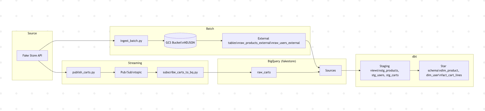

# EY Data Engineering Test

## Architecture

---

## GCP setup: difficulties and solution

Setting up GCP was one of the main difficulties. I ran into multiple blocked accounts (trials or free tier limits) and the need to add a payment method and pay to unlock certain free resources was pretty frustative. The approach was to avoid exporting a service account key and use Application Default Credentials, the scripts and dbt use the same identity without any key file. That way everything runs with ADC only.

---

## Technical approach & learning process

I vibe-coded this project using AI-assisted development tools. I want to be transparent about this approach: it allowed me to learn a lot in a very short time. In a single day, I discovered and learned how to use GCP, Cloud Storage, BigQuery, and Pub/Sub, and pushed the project as far as possible given the timeframe. As discussed during my second interview, I identified the need to significantly deepen my technical skill set, and this project was a concrete way to do so while still delivering a functional result. More broadly, this approach demonstrates my ability to drive a project even when I don’t have all the knowledge up front: I can work effectively with documentation, tools, and assistance to deliver something tangible and clearly explain what was built.

---

## What I didn’t fully grasp

- **Terraform**: I didn’t get to understand or implement the Terraform part; it remained optional for me.
- **dbt**: I understood it as a way to uniformize and align data from several tables so they can be used together in a consistent way (staging views + star schema with dimensions and a fact table). The details (sources, models, tests) I learned by doing, I am also not fully comfortable with bigquery UI, I am pretty sure that I did no completely  leverage the final tables that I have created.
- I was also worried about going over GCP’s free tier limits, so I deliberately toned down the pub/sub scripts (e.g. lower polling frequency, capped number of messages) to limit usage and avoid unexpected charges.

---

## Recap of what was done and difficulties

### 1. Batch ingestion (products & users)

- **Done**: Python script that fetches products and users from the Fake Store API and writes **NDJSON** to a GCS bucket (`raw/products/`, `raw/users/`). BigQuery **external tables** point to these files so the raw data can be queried without loading it into native tables.    
- **Difficulties**: Getting the external table schema to match the API (e.g. `rating` as a struct, `geolocation.long` vs `lng`), and using a single wildcard in the URIs so BigQuery finds the files correctly.

### 2. Near real-time ingestion (carts)

- **Done**: A **publisher** script polls the Carts API and publishes each cart as a message to a Pub/Sub topic. A **subscriber** script pulls messages from a subscription and inserts them into a BigQuery table (`raw_carts`) via streaming insert. Cart date is normalized to a proper date format for BigQuery.    
- **Difficulties**: Understanding how pub/sub work together and in what order (publisher vs subscriber, which to start first). On top of that: creating the topic and subscription in GCP, defining the `raw_carts` table schema, and handling the cart date format so BigQuery accepts it.

### 3. dbt (staging + star schema)

- **Done**: dbt project with **sources** (the three raw tables), **staging models** (views that clean and flatten the data: `stg_products`, `stg_users`, `stg_carts`), and a **marts** layer: dimension tables **dim_product** and **dim_user**, and a fact table **fact_cart_lines** (one row per product line in a cart, with foreign keys to the dimensions). This gives a star schema in BigQuery for analytics. Tests (not_null, unique, relationships) are defined in YAML.    
- **Difficulties**: Naming the project something other than `dbt` to avoid a name clash; the schema/dataset ending up as `fakestore_fakestore` until the custom schema config was removed; duplicate rows in staging (multiple NDJSON files) so unique tests were removed there; parsing `products_json` in the fact model with BigQuery JSON functions and `UNNEST`.

---

## Thanks

This exercise was really interesting, I spent a large part of my weekend on it and got to touch the full pipeline from API to analytics-ready tables. I am looking forward to joining and growing technically so I can better grasp all the subtleties. Thank you for the opportunity.  

Loïk
